# Properties of CNNs
Here are the instructions to help you run the code provided in this directory.

## Dataset provided for the training of the CNNs 
You will be using a synthetic dataset to train your CNNs. The code is already available in the `utils.py` file.
### 1. Examples from the train set
#### Images with class `label 0`

<p align="left"> 
    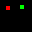 
    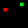 
    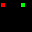 
     
    
</p>

#### Images with class `label 1`

<p align="left"> 
     
    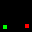 
    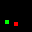 
    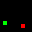 
    
</p>

### 2. Examples from the test set
#### Images with class `label 0`

<p align="left"> 
    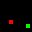 
    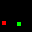 
    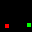 
    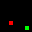 
    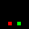
</p>

#### Images with class `label 1`

<p align="left"> 
    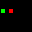 
    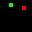 
    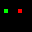 
    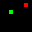 
    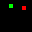
</p>

## Train CNNs with different `net_type` and `conv_type`

You can train the CNNs for your assignment by using the following command.

```bash
python net.py --net_type='Net1' --conv_type='valid'
```

For question `1.1 (b)`, you need to run the above command by varying the ```--conv_type``` argument as mentioned. For question `1.1 (d)`, you need to do the same experiments but with `--net_type` argument set to 'Net2' (an example command is shown below).

```bash
python net.py --net_type='Net2' --conv_type='valid'
```

<span style="color:red">
Note: Please DO NOT report the scores or observations by changing any other argument in the command, except net_type and conv_type. However, you are free to play around with the CNNs by changing other arguments for your own understanding.
</span>
